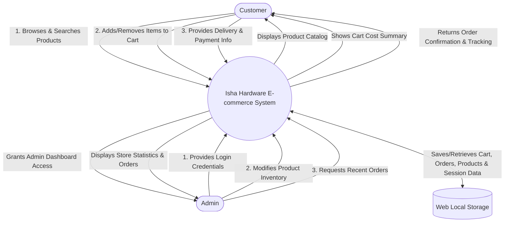

# INDEX

| SR. NO | CHAPTER DETAILS | PAGE NO. |
|---|---|---|
| 1 | INTRODUCTION | 1-5 |
| | 1.1 Existing System | |
| | 1.2 Proposed System | |
| | 1.3 Objectives of the System | |
| 2 | SYSTEM DESIGN | 6-11 |
| | 2.1 DFD | |
| | 2.2 User Interfaces | |
| 3 | IMPLEMENTATION | 12 |
| | 3.1 Hardware Specification | |
| | 3.2 Software Specification | |
| | 3.3 Details of technology and tools used | |
| 4 | USER MANUAL | 13 |
| 5 | PROPOSED ENHANCEMENTS | 14 |
| 6 | BIBLIOGRAPHY | 15 |
| 7 | APPENDIX | 16 |

  

## 1. Introduction

The **Isha Hardware Store** is an advanced online platform designed to allow users to browse, search, and purchase premium hardware tools and materials through a sleek, modern, and intuitive interface. The project is developed using HTML, CSS, and JavaScript, providing robust structure (HTML), premium styling (CSS), and interactive functionalities (JavaScript). The primary goal of this project is to simulate an e-commerce experience where customers can add premium hardware products to their cart, view cart items, track their orders, and seamlessly proceed with the checkout process, all within a responsive platform tailored for professional builders and creators.

### 1.1 Existing System
In a traditional Isha Hardware Store project where processes were done manually, the existing system relied on traditional, paper-based methods to manage the business:
- Customers walked in and physically browsed tools and materials in-store.
- Staff members helped customers and manually recorded the items they wished to purchase on order forms.
- Stock of tools and equipment was checked physically by staff to ensure availability.
- Invoices were written manually or generated using a basic spreadsheet, including customer details and item prices.
- Sales and stock data were entered into a physical ledger or spreadsheet at the end of the business day.
- Delivery logistics were arranged manually, which could be time-consuming.

### 1.2 Proposed System
The Isha Hardware Store proposed system is a fully functional, modern website that features the following:
- **Product Browsing:** Users can view hardware products categorized by type (Power Tools, Hand Tools, Tool Sets, Storage, Materials).
- **Product Details & Search:** By searching for a specific tool, the system filters out relevant products instantaneously.
- **Shopping Cart:** Users can add tools to their cart, view cart contents, and see an automated summary of their total cost. The cart updates automatically using local storage.
- **Checkout & Payment:** Users can input their shipping information through a dedicated checkout page and select their preferred payment method, simulating a real-world secure checkout flow.
- **Order Tracking:** Users have a dedicated page to track the status of their current and past machinery/tool orders.
- **Admin Dashboard:** A specialized interface where administrators can log in to manage product catalogs, view recent orders, and track store statistics.

### 1.3 Objectives of the System
The objective of this project is to computerize the manual operations performed by Isha Hardware, offering a user-friendly and aesthetically premium online hardware store. The store will:
- Allow users to browse through hardware products in various precise categories.
- Provide a smooth, secure-feeling checkout process where users can input their shipping details, review their carts, and complete their orders.
- Enable order tracking and history viewing for transparency.
- Provide store owners (Admins) with an exclusive portal to manage inventory and monitor platform activity efficiently.

---

## 2. SYSTEM DESIGN

### 2.1 DFD

### 2.2 User Interfaces
- **Home Page (index.html):** Dark-themed landing page featuring search functionality, category filters, and a dynamic hardware product grid.
- **Login Page (login.html):** Secure-looking authentication gateway for users and admin access.
- **Cart Page (cart.html):** Dynamic view of items added to the cart along with cost summaries.
- **Checkout Page (checkout.html):** Form interface for collecting user delivery details.
- **Payment Page (payment.html):** Interface to select and finalize the payment method (Credit Card, PayPal, etc.).
- **Order Confirmation Page (order-confirmation.html):** Displays the final order summary and an order tracking ID.
- **Orders Page (orders.html):** Allows users to view their active and completed orders in a timeline format.
- **Admin Dashboard (admin.html):** Comprehensive interface for managing inventory, viewing store performance metrics, and handling recent customer orders.

---

## 3. IMPLEMENTATION

### 3.1 Hardware Specification
1. **Processor:** Intel Core i3 or equivalent
2. **RAM:** 4GB (8GB recommended)
3. **Storage:** 10GB free space

### 3.2 Software Specification
1. **Operating System:** Windows 10 or above
2. **Development Tool:** VS Code / Sublime Text

### 3.3 Details of technology and tools used
1. **Front-End:** HTML5, Modern CSS3 (utilizing Flexbox, Grid, and CSS Variables for glowing dark themes)
2. **Back-End:** Vanilla JavaScript (ES6+), leveraging Web Storage API (LocalStorage) for session data
3. **Web Browser:** Google Chrome / Mozilla Firefox / Internet Explorer / Microsoft Edge / Safari

---

## 4. USER MANUAL
- **Getting Started:** Open `index.html` on your desktop or mobile browser.
- **Browsing & Searching:** Use the navigation menu and search bar to explore tool categories (Power Tools, Hand Tools, Tool Sets, etc.).
- **Adding to Cart:** Click the shopping cart icon on the product cards to add them to your cart.
- **Checkout Flow:** Click on the "Cart" button in the header, review your items, click "Proceed to Checkout", fill out the shipping address, proceed to "Payment", and complete the order.
- **Tracking:** Click on "Track Orders" to see your purchase history.
- **Admin Access:** Navigate to "Login" and log in using an admin email (e.g., `admin@admin.com`) to be redirected to the Admin Dashboard.

---

## 5. PROPOSED ENHANCEMENTS
In the current Isha Hardware Store management system, we use local storage to simulate dynamic behaviors instead of a backend database to keep the system lightweight. In the proposed enhancements, we will:
- Integrate a real backend database (such as MongoDB or MySQL) to achieve full persistent dynamic records.
- Enable users to create persistent accounts, reset passwords, and track real-time GPS shipments.
- Allow the admin to fully create, read, update, and delete (CRUD) user details and handle inventory dynamically across multiple sessions.
- Enhance the website with an integrated payment gateway system (like Stripe or Razorpay) for real transactions.
- All these functionalities will be developed in the next major version iteration.

---

## 6. BIBLIOGRAPHY
- www.youtube.com
- www.chatgpt.com
- www.google.com
- developer.mozilla.org (MDN Web Docs)
- www.w3schools.com

---

## 7. APPENDIX
*This section typically includes the uncompiled source code snippets, database schemas (if applicable), or wireframe diagrams constructed during the planning phase of the website.*
